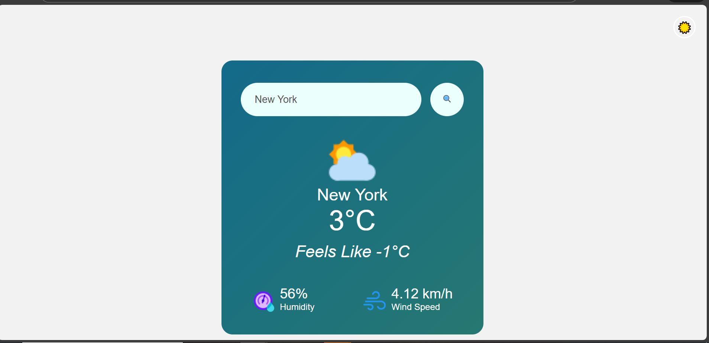

# Weather App

A simple, responsive weather application that fetches real-time weather data for any city using the OpenWeathermap API. Built with HTML, CSS and JavaScript.

## Demo
https://shraddhapant21-star.github.io/weather-app/

## Features
- Search weather by city name
- Displays temperature, weather description, humidity and wind speed
- Weather icons for current conditions
- Dark Mode and Light Mode toggle
- Responsive layout for mobile and desktop

## 📸 Screenshot



## Technologies
- HTML
- CSS
- JavaScript
- OpenWeathermap API


## How to run locally
1. Clone the repo:
   ```bash
   git clone https://github.com/shraddhapant21-star/weather-app.git
   ```
2. Open the folder  
3. Open `index.html` in your browser
